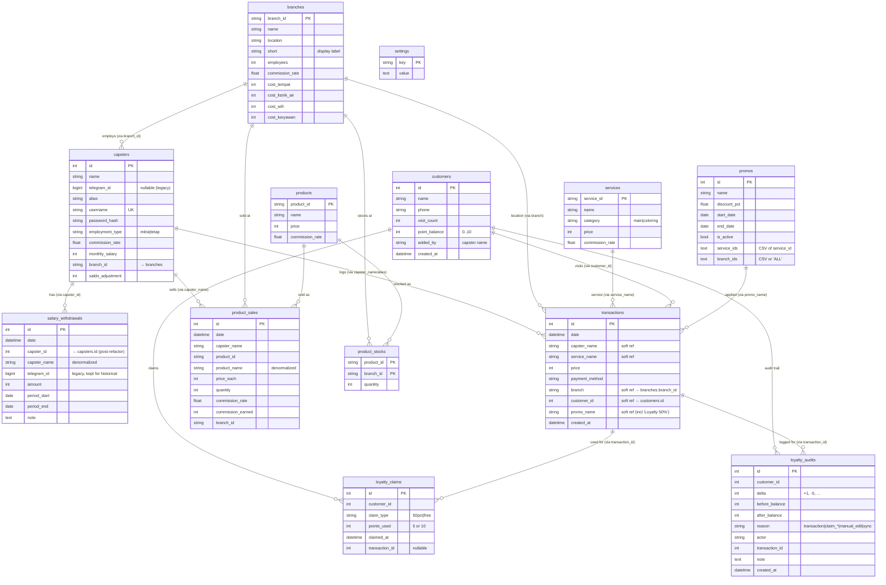

# DB Schema / ERD — Barbershop Management

Skema database PostgreSQL untuk aplikasi. **13 tabel**, definisi ORM di [`app/db/models.py`](app/db/models.py).

> Catatan penting: relasi **tidak pakai FK constraint** — semua join logikal (soft reference).
> Delete tidak cascade. Detail di bagian "Known Issues" di akhir.

## ERD



---

## Detail per Tabel

### 1. `capsters` — Master capster
Kolom identitas + auth + kompensasi.

| Kolom | Tipe | Constraint | Keterangan |
|---|---|---|---|
| `id` | Integer | PK, autoincrement | **Identifier utama** (dipakai sejak refactor 2026-07) |
| `name` | String(100) | NOT NULL | Nama lengkap capster |
| `telegram_id` | BigInteger | nullable | Legacy dari era bot Telegram. Sekarang opsional (tetap dipertahankan untuk data historis) |
| `alias` | String(100) | nullable | Nama alternatif di transaksi (kalau capster ganti nama, `capster_name` lama match via alias) |
| `username` | String(50) | UNIQUE | Login portal capster |
| `password_hash` | String(255) | nullable | pbkdf2:sha256 hash |
| `employment_type` | String(20) | `IN ('mitra','tetap')` | Skema gaji |
| `commission_rate` | Float | default 0.5 | 50% (untuk mitra) — komisi dari revenue layanan |
| `monthly_salary` | Integer | default 0 | Gaji bulanan (untuk tetap) |
| `branch_id` | String(50) | nullable | Ref soft ke `branches.branch_id` |
| `saldo_adjustment` | Integer | default 0 | Kompensasi manual saat tipe/gaji berubah (lihat kolom di `/capsters/manage` edit modal) |

**Indexes:** —  
**Ex-constraints yang dihapus:** `UniqueConstraint('telegram_id')` dihapus 2026-07 karena `telegram_id` sekarang nullable.

---

### 2. `customers` — Master customer
| Kolom | Tipe | Constraint | Keterangan |
|---|---|---|---|
| `id` | Integer | PK | |
| `name` | String(100) | NOT NULL | |
| `phone` | String(30) | nullable | Regex-validated `^[\d\+\-\s]{0,30}$` di form add/edit (anti stored XSS) |
| `visit_count` | Integer | default 0 | Kunjungan lifetime; +1 tiap transaksi dgn `customer_id` set |
| `point_balance` | Integer | default 0 | Poin loyalty aktif (cap 10). Berkurang saat klaim |
| `added_by` | String(100) | nullable | Nama capster yang mendaftarkan |
| `created_at` | DateTime | default now | UTC |

---

### 3. `transactions` — Setiap transaksi layanan
| Kolom | Tipe | Constraint | Keterangan |
|---|---|---|---|
| `id` | Integer | PK | |
| `date` | DateTime | NOT NULL | Waktu transaksi |
| `capster_name` | String(100) | NOT NULL | Raw string (BUKAN FK) — supports alias matching legacy |
| `service_name` | String(100) | NOT NULL | Nama layanan; bisa ditulis "Nama (Paket X)" untuk family |
| `price` | Integer | NOT NULL | Harga final (setelah diskon promo/loyalty) |
| `payment_method` | String(20) | default 'Cash' | `Cash \| QRIS` |
| `branch` | String(50) | nullable | Ref soft ke `branches.branch_id` (bukan `short`!) |
| `customer_id` | Integer | nullable | Ref soft ke `customers.id`. Walk-in kalau NULL |
| `promo_name` | String(100) | nullable | Nama promo, atau `'Loyalty 50%'` / `'Loyalty Gratis'` |
| `created_at` | DateTime | default now | |

**Indexes:**
- `ix_transactions_date` (date)
- `ix_transactions_branch` (branch)
- `ix_transactions_capster_date` (capster_name, date)

---

### 4. `services` — Master layanan
| Kolom | Tipe | Constraint | Keterangan |
|---|---|---|---|
| `service_id` | String(50) | PK | PascalCase (mis. `PotongCuci`) |
| `name` | String(100) | NOT NULL | Display name |
| `category` | String(20) | `IN ('main','coloring')` | |
| `price` | Integer | default 0 | Harga standard |
| `commission_rate` | Float | default 0.5 | Komisi mitra untuk layanan ini |

---

### 5. `branches` — Master cabang
| Kolom | Tipe | Constraint | Keterangan |
|---|---|---|---|
| `branch_id` | String(50) | PK | snake_case (mis. `cabang_a`) |
| `name` | String(100) | NOT NULL | Nama lengkap (mis. "Cabang Denailla") |
| `location` | String(100) | nullable | Kota/alamat |
| `short` | String(50) | nullable | Label pendek (mis. "Cabang A") untuk display |
| `employees` | Integer | default 2 | Jumlah karyawan |
| `commission_rate` | Float | default 0 | Fallback rate; capster commission_rate biasanya override |
| `cost_tempat` | Integer | default 0 | Biaya sewa/bulan (dipakai `calc_profit`) |
| `cost_listrik_air` | Integer | default 0 | |
| `cost_wifi` | Integer | default 0 | |
| `cost_karyawan` | Integer | default 0 | Unused sekarang (tetap salary datang dari `capsters.monthly_salary`) |

---

### 6. `products` — Master produk
| Kolom | Tipe | Keterangan |
|---|---|---|
| `product_id` | String(50) | PK — PascalCase |
| `name` | String(100) | Display name |
| `price` | Integer | Harga jual |
| `commission_rate` | Float | Komisi capster untuk produk ini |

---

### 7. `product_stocks` — Stok produk per cabang
| Kolom | Tipe | Keterangan |
|---|---|---|
| `product_id` | String(50) | **Composite PK** (bagian 1) |
| `branch_id` | String(50) | **Composite PK** (bagian 2) |
| `quantity` | Integer | ≥ 0 (`adjust_stock` floor ke 0) |

Stok per (product × branch). Guard: `add_product_sale` tolak kalau `quantity < requested` (fix K-9).

---

### 8. `product_sales` — Penjualan produk
| Kolom | Tipe | Keterangan |
|---|---|---|
| `id` | Integer | PK |
| `date` | DateTime | |
| `capster_name` | String(100) | Soft ref (denormalized) |
| `product_id` | String(50) | Soft ref ke `products.product_id` |
| `product_name` | String(100) | Denormalized supaya jelas kalau product dihapus |
| `price_each` | Integer | Snapshot harga saat jual |
| `quantity` | Integer | ≥ 1 |
| `commission_rate` | Float | Snapshot |
| `commission_earned` | Integer | `price_each × qty × rate` |
| `branch_id` | String(50) | Soft ref |

**Index:** `ix_product_sales_capster_date` (capster_name, date)

---

### 9. `loyalty_claims` — Riwayat klaim poin
Log setiap kali customer klaim poin (Diskon 50% / Potong Gratis).

| Kolom | Tipe | Keterangan |
|---|---|---|
| `id` | Integer | PK |
| `customer_id` | Integer | Ref soft ke `customers.id` |
| `claim_type` | String(20) | `'50pct'` atau `'free'` |
| `points_used` | Integer | 5 atau 10 |
| `claimed_at` | DateTime | |
| `transaction_id` | Integer | Ref soft ke `transactions.id` — tx yang dapat diskon |

**Index:** `ix_loyalty_customer` (customer_id)

---

### 10. `loyalty_audits` — Audit trail perubahan `point_balance`
Read-only history. Setiap row = 1 event delta.

| Kolom | Tipe | Keterangan |
|---|---|---|
| `id` | Integer | PK |
| `customer_id` | Integer | |
| `delta` | Integer | +1 saat transaksi normal, -5/-10 saat klaim, dsb |
| `before_balance` | Integer | Snapshot poin sebelum |
| `after_balance` | Integer | Snapshot poin sesudah |
| `reason` | String(30) | `'transaction'`, `'claim_50pct'`, `'claim_free'`, `'manual_edit'`, `'sync'` |
| `actor` | String(100) | Capster/admin yang trigger |
| `transaction_id` | Integer | Soft ref (nullable) |
| `note` | Text | Deskripsi manual |
| `created_at` | DateTime | |

**Indexes:**
- `ix_loyalty_audit_customer` (customer_id)
- `ix_loyalty_audit_created` (created_at)

View di UI: `/customers/<id>/loyalty`

---

### 11. `promos` — Diskon berkala
| Kolom | Tipe | Keterangan |
|---|---|---|
| `id` | Integer | PK |
| `name` | String(100) | |
| `discount_pct` | Float | 0-100 |
| `start_date` | Date | |
| `end_date` | Date | Inclusive |
| `is_active` | Boolean | Toggle manual |
| `service_ids` | Text | **CSV** dari `service_id` — mis. `"Potong,PotongCuci"` |
| `branch_ids` | Text | **CSV** atau `'ALL'` |

---

### 12. `settings` — Key-value config
| Kolom | Tipe | Keterangan |
|---|---|---|
| `key` | String(100) | PK |
| `value` | Text | |

**Keys yang dipakai:**
- `fonnte_token` — WhatsApp gateway token
- `wa_template` — Template pesan WA (support `{nama}`, `{kunjungan}`)
- `wa_auto_send` — `'1'` / `'0'` (auto kirim WA ketika customer baru daftar)
- `app_base_url` — Base URL untuk QR link di WA
- `paket_members` — CSV pilihan family member paket

---

### 13. `salary_withdrawals` — Penarikan gaji/komisi capster
| Kolom | Tipe | Keterangan |
|---|---|---|
| `id` | Integer | PK |
| `date` | DateTime | Waktu penarikan |
| `capster_id` | Integer | **Identifier utama** (post-refactor 2026-07) — ref soft ke `capsters.id` |
| `capster_name` | String(100) | Denormalized (tetap ada nama kalau capster dihapus) |
| `telegram_id` | BigInteger | Legacy — dipertahankan untuk data historis |
| `amount` | Integer | Rp |
| `period_start` | Date | nullable — periode kerja yang ditarik |
| `period_end` | Date | Validated `start <= end` di route (fix S-11) |
| `note` | Text | Catatan admin |

**Index:** `ix_salary_capster_period` (capster_id, period_start, period_end)

---

## Formula Bisnis (bukan schema, tapi related)

### Saldo capster (all-time)
```
saldo = (rev_all × commission_rate) + product_commission - withdrawn + saldo_adjustment
```
- `rev_all` = SUM(`transactions.price`) WHERE `capster_name` = capster.name/alias
- `product_commission` = SUM(`product_sales.commission_earned`)
- `withdrawn` = SUM(`salary_withdrawals.amount`) WHERE `capster_id` = capster.id
- `saldo_adjustment` = manual override untuk kompensasi

Kode: `web/routes/withdraw.py:_build_capster_balances`, `web/routes/capsters.py:capsters()`, `web/routes/capster_portal.py:dashboard()`

### Loyalty
- +1 poin per transaksi dengan `customer_id`, cap 10
- Klaim 50%: pakai 5 poin, balance = max(0, before - 5)
- Klaim Free: pakai 10 poin, balance = max(0, before - 10)
- Visibility lenient: `include_next=True` → antisipasi +1 (customer 4 poin sudah lihat opsi 50%)

Kode: `app/db/repository.py:add_customer_points`, `use_loyalty_claim`, `get_loyalty_status`

### Profit per cabang per bulan
```
revenue     = SUM(transactions.price)  filter bulan+branch
fixed_ops   = branch.cost_tempat + cost_listrik_air + cost_wifi
tetap_total = SUM(capster.monthly_salary WHERE type=tetap AND branch_id=this)
commission  = SUM(mitra_revenue × capster.commission_rate)
total_cost  = fixed_ops + tetap_total + commission
net_profit  = revenue - total_cost
```
Kode: `app/services/reports.py:calc_profit`

---

## Known Issues (schema-level)

### K-8 — Zero cascade
**Tidak ada `ForeignKey` sama sekali** di ORM. Delete row tidak clean up dependent rows:

| Delete apa | Yang jadi orphan |
|---|---|
| `capsters` | Semua row di `transactions` (via `capster_name`), `product_sales`, `salary_withdrawals` → nama string masih ada, tapi `capster_id` FK mati |
| `customers` | `transactions.customer_id`, `loyalty_claims.customer_id`, `loyalty_audits.customer_id` |
| `services` | `transactions.service_name` (masih tampil, tapi service tidak ada) |
| `branches` | `transactions.branch`, `product_stocks.branch_id`, `product_sales.branch_id`, `capsters.branch_id` |
| `products` | `product_stocks`, `product_sales` |
| `promos` | `transactions.promo_name` (label saja) |

**Rekomendasi:** untuk safety, tambah check `dependent_count > 0` di route delete → tolak / minta konfirmasi tambahan.

### K-3 — Employment history tidak ter-track
`capsters.employment_type` cuma value saat ini. Kalau capster pindah dari `tetap` → `mitra`, semua transaksi historis di-rewrite dengan formula mitra → saldo bisa langsung minus. Workaround via kolom `saldo_adjustment`. Solusi proper: tabel `capster_employment_periods`.

### Constants vs DB
`app/config/constants.py` masih punya struktur `BRANCHES`, `SERVICES_MAIN`, `SERVICES_COLORING`, `PRODUCTS` — TAPI cuma dipakai sebagai **seed data** kalau tabel DB kosong. Live source = DB. Setelah K-4 fix, `calc_profit` sudah baca dari DB.

---

## Migration History

| Rev | Deskripsi | File |
|---|---|---|
| 0001 | Initial schema (7 core tables) | `alembic/versions/0001_initial_schema.py` |
| 0002 | Add `capsters.monthly_salary` + `capsters.branch_id` | `alembic/versions/0002_capster_salary_branch.py` |
| — | Auto-migrate: `capsters.username`, `capsters.password_hash`, `capsters.saldo_adjustment`, `customers.visit_count`, `customers.added_by`, `customers.created_at`, `customers.point_balance`, `transactions.customer_id`, `transactions.promo_name`, `services.commission_rate`, `products.commission_rate`, `salary_withdrawals.capster_id` | `app/db/database.py:_migrate_capster_auth_columns` (jalan setiap startup, `ADD COLUMN IF NOT EXISTS`) |
| — | `capsters.telegram_id` → `nullable=True`, drop `UniqueConstraint` | `scripts/_migrate_capster_id.py` (one-off, 2026-07) |

**Note:** Alembic belum dipakai secara aktif — DB kelola via `init_db()` self-migrate pattern. Rev files di `alembic/` sebagian legacy.

---

Docs terkait: [ARCHITECTURE.md](ARCHITECTURE.md) · [CLAUDE.md](CLAUDE.md) · [TODO.md](TODO.md)
